# HOTSPOT Dummy Data Generator

통신사 가족 데이터 공유/차단 정책 서비스를 위한
**대규모 더미 데이터 생성 및 PostgreSQL 적재 도구**

✔ 100만 사용자 생성  
✔ 가족 데이터 공유 구조 생성  
✔ 정책/차단/선물 데이터 시뮬레이션  
✔ Envelope Encryption + Blind Index 적용  
✔ PostgreSQL COPY 기반 고속 적재  

---
## 📦 프로젝트 구조
```
.generator-dummy/
├── scripts/
│   ├── run_all.py            # 통합 실행
│   ├── db_loader.py          # DB 로딩
│   ├── team_seed.py          # 팀원/가족 테스트 데이터 오버레이
│   ├── team_fixture.json     # 팀원/가족 테스트 fixture
│   └── generator/
│       ├── generator_master.py
│       ├── utils.py
│       ├── constants.py
│       └── csv_writer.py
├── config/
│   └── db_config.py
├── sql/
│   ├── 01_drop_tables.sql
│   ├── 02_create_tables.sql
│   ├── 03_insert_master_data.sql
│   └── 04_create_indexes.sql
├── output/                   # 생성된 CSV
├── docs/
│   ├── data-rules.md
│   ├── encryption.md
│   ├── loader-guide.md
│   └── team-seed-guide.md
├── .env
├── .env.example
└── requirements.txt
```

---
## 🚀 주요 기능
✔ 사용자 & 회선 생성
- 1,000,000 회원
- 1,000,000 회선 생성

✔ 가족 그룹 구성
- 2~8명 가족 구성
- 역할:
  - OWNER
  - PARENT
  - CHILD
- 데이터 공유 정책:
  - FIFO
  - PRIORITY

✔ 정책 & 차단 시스템 시뮬레이션
- 시간 차단 정책 적용
- 앱 서비스 차단
- 정책 적용 알림 자동 생성
- 정책 테이블(`block_policy`)에서 관리자/가족 대표 정책 통합 관리
- 정책-구성원 매핑(`policy_sub`) 기반 적용 관리

✔ 가족 신청/삭제 처리 구조
- 가족 신청(`family_apply`)은 ADD/REMOVE/CREATE 요청을 관리
- 신청 대상자(`family_apply_target`)는 다건 대상자 매핑 지원
- 가족 구성원 삭제는 즉시 반영하지 않고 스케줄(`family_remove_schedule`) 기반 반영
- 더미 생성 시 신청 상태는 모두 `PENDING`
- `CREATE`: 비가족 신청자 + 요청자 제외 대상자 2~8명 (5~10건)
- `ADD`: 기존 가족 대표 신청 + 비가족 대상자 1명 이상 (4~5건, 가족 최대 8명 제한)
- `REMOVE`: 기존 가족 대표 신청 + 가족 구성원 대상자 1명 이상 (4~5건, 삭제 후 최소 2명 보장)

✔ 데이터 선물 이벤트
- 부모 → 자녀 데이터 선물
- 요금제 기준 선물 용량 제한
- 일 단위 요금제 / 1.5GB 요금제는 선물 데이터 생성 제외

✔ 개인정보 보호 설계
- 전화번호 AES-GCM 암호화 저장
- Blind Index 해시 검색 지원

---
## 🧩 ERD

```mermaid
erDiagram
    MEMBER{
        BIGINT member_id PK
        VARCHAR(10) name
        VARCHAR(6) birth
        VARCHAR(10) status
        BOOL is_deleted
        DATETIME created_time
        DATETIME modified_time
    }

    FAMILY {
        BIGINT family_id PK
        INTEGER family_num
        BIGINT family_data_amount
        ENUM priority_type
        BOOL is_deleted
        DATETIME created_time
        DATETIME modified_time
    }

    FAMILY_SUB {
        BIGINT family_sub_id PK
        BIGINT sub_id FK
        BIGINT family_id FK
        ENUM family_role
        INTEGER priority
        BIGINT data_limit
    }

    SUBSCRIPTION {
        BIGINT sub_id PK
        BIGINT plan_id FK
        BIGINT member_id FK
        VARCHAR(255) phone_enc
        VARCHAR(64) phone_hash
        INTEGER phone_key_bucket_id
        INTEGER phone_key_version
        BOOL is_locked
        BOOL is_deleted
        DATETIME created_time
        DATETIME modified_time
    }

    SUBSCRIPTION_KEY {
        BIGINT subscription_key_id PK
        INTEGER bucket_id
        INTEGER key_version
        TEXT encrypted_dek
        VARCHAR(255) kek_key_id
        VARCHAR(20) status
        DATETIME created_time
        DATETIME modified_time
    }

    PLAN {
        BIGINT plan_id PK
        VARCHAR(20) plan_name
        BIGINT plan_data_amount
        VARCHAR(10) data_period
        BOOL is_deleted
        DATETIME created_time
        DATETIME modified_time
    }

    SOCIAL_ACCOUNT {
        BIGINT social_account_id PK
        BIGINT member_id FK
        VARCHAR(50) email
        VARCHAR(50) social_id
        VARCHAR(10) provider
        BOOL is_deleted
        DATETIME created_time
        DATETIME modified_time
    }

    APP_BLOCKED_SERVICE {
        BIGINT app_blocked_service_id PK
        VARCHAR(30) blocked_service_name
        VARCHAR(30) blocked_service_code
        BOOL is_active
        BOOL is_deleted
    }

    BLOCKED_SERVICE_SUB {
        BIGINT blocked_service_sub_id PK
        BIGINT sub_id FK
        BIGINT blocked_service_id FK
        BOOL is_active
    }

    BLOCK_POLICY {
        BIGINT block_policy_id PK
        VARCHAR(30) policy_name
        ENUM policy_type
        JSON policy_snapshot
        BOOL is_active
        BOOL is_deleted
    }

    POLICY_SUB {
        BIGINT policy_sub_id PK
        BIGINT sub_id FK
        BIGINT block_policy_id FK
        BOOL is_active
    }

    FAMILY_APPLY {
        BIGINT family_apply_id PK
        BIGINT requester_sub_id FK
        BIGINT family_id FK
        ENUM apply_type
        VARCHAR(255) doc_url
        ENUM status
        DATETIME created_time
        DATETIME modified_time
    }

    FAMILY_APPLY_TARGET {
        BIGINT family_apply_target_id PK
        BIGINT family_apply_id FK
        BIGINT target_sub_id FK
        ENUM target_family_role
    }

    FAMILY_REMOVE_SCHEDULE {
        BIGINT family_remove_schedule_id PK
        BIGINT target_sub_id FK
        BIGINT family_id FK
        ENUM status
        DATE schedule_date
        DATETIME created_time
        DATETIME modified_time
    }

    NOTIFICATION {
        BIGINT notification_id PK
        BIGINT sub_id FK
        VARCHAR(50) notification_type
        VARCHAR(100) notification_title
        VARCHAR(200) notification_content
        DATETIME created_time
        BOOL is_read
        VARCHAR(100) event_id
    }

    NOTIFICATION_ALLOW {
        BIGINT notification_allow_id PK
        BIGINT sub_id FK
        VARCHAR(20) notification_category
        BOOL notification_allow
        BOOL is_deleted
        DATETIME created_time
        DATETIME modified_time
    }

    PRESENT_DATA {
        BIGINT present_data_id PK
        BIGINT target_sub_id FK
        BIGINT provide_sub_id FK
        BIGINT data_amount
        DATETIME created_time
    }

    MEMBER ||--o{ SUBSCRIPTION : owns
    MEMBER ||--o{ SOCIAL_ACCOUNT : has
    PLAN ||--o{ SUBSCRIPTION : provides
    FAMILY ||--o{ FAMILY_SUB : has
    SUBSCRIPTION ||--o{ FAMILY_SUB : mapped
    SUBSCRIPTION ||--o{ NOTIFICATION : receives
    SUBSCRIPTION ||--o{ NOTIFICATION_ALLOW : configures
    SUBSCRIPTION ||--o{ PRESENT_DATA : target_sub
    SUBSCRIPTION ||--o{ PRESENT_DATA : provide_sub
    SUBSCRIPTION ||--o{ POLICY_SUB : applies
    BLOCK_POLICY ||--o{ POLICY_SUB : mapped
    SUBSCRIPTION ||--o{ BLOCKED_SERVICE_SUB : applies
    APP_BLOCKED_SERVICE ||--o{ BLOCKED_SERVICE_SUB : mapped
    FAMILY ||--o{ FAMILY_APPLY : owns
    FAMILY_APPLY ||--o{ FAMILY_APPLY_TARGET : has
    SUBSCRIPTION ||--o{ FAMILY_APPLY : requester
    SUBSCRIPTION ||--o{ FAMILY_APPLY_TARGET : target
    FAMILY ||--o{ FAMILY_REMOVE_SCHEDULE : schedules
    SUBSCRIPTION ||--o{ FAMILY_REMOVE_SCHEDULE : target
```


---
## 🧱 마스터 템플릿

### 요금제 템플릿 (`plan`)
| 요금제명 | 데이터 제공량 | 제공량 기준 |
| --- | --- | --- |
| 5G 시그니처 | 무제한 | MONTH |
| 5G 스탠다드 | 150GB | MONTH |
| 5G 베이직+ | 24GB | MONTH |
| LTE 데이터 33 | 1.5GB | MONTH |
| LTE 다이렉트 45 | 1GB | DAY |


### 앱 차단 서비스 (`app_blocked_service`)
| 서비스명 | 서비스 코드 |
| --- | --- |
| 카카오톡 | `MSG_KAKAO` |
| 라인 | `MSG_LINE` |
| YouTube | `MEDIA_YOUTUBE` |
| Netflix | `MEDIA_NETFLIX` |
| 치지직 | `MEDIA_CHZZK` |
| SOOP | `MEDIA_SOOP` |
| Instagram | `SNS_INSTAGRAM` |
| TikTok | `SNS_TIKTOK` |
| Facebook | `SNS_FACEBOOK` |
| EBS | `STUDY_EBS` |
| 메가스터디 | `STUDY_MEGA` |
| 업비트 | `FIN_UPBIT` |
| 키움증권 | `FIN_KIWOOM` |
| Chrome | `WEB_CHROME` |
| Safari | `WEB_SAFARI` |
| 롤토체스 | `GAME_TFT` |
| 배틀그라운드 | `GAME_PUBG` |
| 네이버 웹툰 | `TOON_NAVER` |
| 카카오 웹툰 | `TOON_KAKAO` |

### 시간/즉시 차단 정책 템플릿 (`block_policy`)
| 정책명 | 정책 유형 | 설명 |
| --- | --- | --- |
| 수면 모드 | `SCHEDULED` | 매일 지정한 수면 시간 동안 앱 사용을 제한해 규칙적인 생활을 돕는 정책 |
| 방해 금지 모드 | `ONCE` | 일정 시간 동안 즉시 앱 사용을 차단해 집중이 필요한 순간을 지원하는 정책 |
| 수업 집중 모드 | `SCHEDULED` | 평일 수업 시간에 맞춰 앱 사용을 자동 제한해 학습 집중도를 높이는 정책 |
| 시험 기간 집중 모드 | `ONCE` | 시험 대비 기간에 장시간 앱 사용을 제한해 학습 몰입을 강화하는 정책 |

**수면 모드**
```json
{
  "days": ["MONDAY", "TUESDAY", "WEDNESDAY", "THURSDAY", "FRIDAY", "SATURDAY", "SUNDAY"],
  "startTime": "00:00",
  "endTime": "07:00"
}
```

**방해 금지 모드**
```json
{
  "durationMinutes": 180
}
```

**수업 집중 모드**
```json
{
  "days": ["MONDAY", "TUESDAY", "WEDNESDAY", "THURSDAY", "FRIDAY"],
  "startTime": "09:00",
  "endTime": "14:00"
}
```

**시험 기간 집중 모드**
```json
{
  "startTime": "06:00",
  "endTime": "23:59"
}
```

---
## ⚙️ 설치
```
pip install -r requirements.txt
```

---
## 🔐 환경변수 설정
.env.example 복사:
```
cp .env.example .env
```

환경에 맞게 수정:
```
DB_HOST=localhost
DB_PORT=5432
DB_NAME=hotspot
DB_USER=postgres
DB_PASSWORD=postgres

# Encryption provider: kms | local
ENCRYPTION_PROVIDER=kms
AWS_REGION=ap-northeast-2
KEK_KEY_ID=arn:aws:kms:ap-northeast-2:123456789012:key/xxxxxxxx-xxxx-xxxx-xxxx-xxxxxxxxxxxx
AWS_ACCESS_KEY_ID=your_iam_access_key_id
AWS_SECRET_ACCESS_KEY=your_iam_secret_access_key
# AWS_SESSION_TOKEN=your_session_token  # temporary credentials only

# HMAC key for blind index
HASH_KEY=your_base64_hmac_key_here

# local fallback (ENCRYPTION_PROVIDER=local only)
SECRET_KEY=your_base64_32byte_key_here
```

> .env가 없으면 config/db_config.py 기본값 사용

---
## ▶ 실행 방법
더미 전체 실행 (CSV 생성 + DB 적재)
```
python scripts/run_all.py
```

팀원/가족 테스트 데이터 오버레이
```
python scripts/team_seed.py
```

> `scripts/team_fixture.json` 수정 후 실행  
> 권장 순서: `python scripts/run_all.py` -> `python scripts/team_seed.py`

### team_fixture.json 가이드
- `members`: 팀원 사용자 정의 (social_account는 생성하지 않음)
- `families`: `member_key` 기준 가족 구성 정의
- 상세 작성 규칙: `docs/team-seed-guide.md`

---
## 📊 생성 데이터 규모
| 테이블                 | 예상 건수      |
| ------------------- | ---------- |
| member              | 1,000,000  |
| subscription        | 1,000,000  |
| family              | 250,000    |
| family_sub          | ~860,000   |
| family_apply        | 13~20      |
| family_apply_target | 가변 (타입별 대상자 수 합계) |
| block_policy        | 마스터 + 가족 정책 생성 건수만큼 증가 |
| notification_allow  | 4,000,000  |
| blocked_service_sub | ~650,000   |
| policy_sub          | 가변 (가족 정책 수 × 가족 구성원 수) |
| notification        | ~1,000,000 |

---
## 🔐 암호화 설계
**Envelope Encryption + Data Encryption**

- 키 경계: `sub_id % 1000` 버킷 단위 DEK
- 신규 암호화: `AES-256-GCM`
- 저장 포맷: `gcm:<base64(nonce + ciphertext + tag)>`
- 복호화: GCM 우선, legacy CBC fallback 지원

✔ 동일 값도 매번 다른 암호문 생성  
✔ 위변조(tag) 검증 지원

**Blind Index**

전화번호 검색을 위한 해시:
```
HMAC-SHA256(phone, HASH_KEY)
```

✔ 평문 검색 가능  
✔ 개인정보 노출 방지  

---
## ⚡ 성능 최적화 전략
✔ PostgreSQL COPY 사용  
✔ 인덱스 후 생성 전략   
✔ 버퍼링 CSV 쓰기  
✔ 대량 데이터 처리 최적화  

---
## 🧠 활용 목적
✔ API 성능 테스트  
✔ 정책 엔진 검증  
✔ 데이터 공유 로직 테스트  
✔ 대용량 트래픽 시뮬레이션  
✔ 보안 설계 검증  

---
## 📚 문서
| 문서              | 설명        |
| --------------- | --------- |
| data-rules.md   | 데이터 생성 규칙 |
| encryption.md   | 암호화 설계    |
| loader-guide.md | DB 적재 가이드 |
| team-seed-guide.md | 팀 시드/fixture 가이드 |

---
## 🛠 기술 스택
- Python
- PostgreSQL
- psycopg2 COPY
- AWS KMS (optional)
- AES-GCM Encryption
- HMAC SHA256
- Bulk Data Simulation
